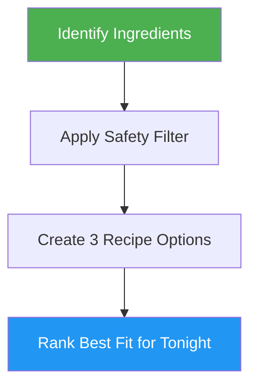

<!--
  DO NOT READ THIS FILE - This README.md is for human catalog browsing only.
  It ships inside the .skill package but is NEVER auto-loaded into agent context.
  The runtime loader only reads SKILL.md + references/ + scripts/ + agents/ when the skill triggers.
  If you're an AI agent, read the SKILL.md file instead for skill instructions.
-->

# Quick Healthy Recipes

> Generate three simple, fast, healthy recipes from food photos, ingredients, or a short cooking idea.

## Highlights

- Works from attached food images or plain ingredient descriptions
- Produces exactly 3 realistic weeknight recipe options
- Keeps extra ingredients common and minimal
- Prioritizes quick prep, no special equipment, and balanced meals
- Flags uncertainty or food-safety concerns instead of guessing dangerously

## When to Use

| Say this... | Skill will... |
|---|---|
| "What can I cook with this?" | Identify the food and suggest 3 fast healthy recipes |
| "I have eggs, rice, and spinach" | Build 3 simple recipes around those ingredients |
| "Find the best recipe for this tonight" | Rank the quickest, most practical option first |
| "I want something healthy and quick" | Suggest balanced recipes with common add-ons only |

## How It Works



## Usage

```
/quick-healthy-recipes
```

## Output

A concise answer with exactly 3 recipes, each including time, best-use case, common extra ingredients, short steps, healthy balance notes, and one final pick for tonight.
