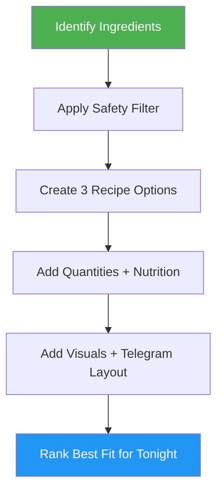

<!--
  DO NOT READ THIS FILE - This README.md is for human catalog browsing only.
  It ships inside the .skill package but is NEVER auto-loaded into agent context.
  The runtime loader only reads SKILL.md + references/ + scripts/ + agents/ when the skill triggers.
  If you're an AI agent, read the SKILL.md file instead for skill instructions.
-->

# Quick Healthy Recipes

> Generate three simple, fast, healthy recipes with quantities, estimated nutrition, Telegram-friendly formatting, visual guidance, and process/final images from food photos, ingredients, recipe search, or a short cooking idea.

## Highlights

- Works from attached food images or plain ingredient descriptions
- Produces exactly 3 realistic weeknight recipe options
- Gives servings and practical ingredient quantities when possible
- Adds estimated health score, calories, protein, sugar, sodium/salt, and vitamin highlights for each recipe
- Uses compact Telegram-friendly bullets and avoids markdown tables
- Adds visual step cues plus prep, mid-cook, and finished-output image guidance for every recipe
- Uses generated/attached images when available, and downloads searched recipe images only when reuse rights are clear
- Keeps extra ingredients common and minimal
- Prioritizes quick prep, no special equipment, and balanced meals
- Flags uncertainty or food-safety concerns instead of guessing dangerously

## When to Use

- **"What can I cook with this?"** — Identify the food and suggest 3 fast healthy recipes.
- **"I have eggs, rice, and spinach"** — Build 3 simple recipes around those ingredients.
- **"Find the best recipe for this tonight"** — Search recipe sources, rank the quickest practical option first, and include quantities, nutrition estimates, and image guidance.
- **"I want something healthy and quick"** — Suggest balanced recipes with common add-ons only.

## How It Works



## Usage

```
/quick-healthy-recipes
```

## Output

A concise Telegram-friendly answer with exactly 3 recipes. Each recipe includes time, servings, quantities, steps, visual cues, healthy balance notes, estimated nutrition per serving, and prep/mid-cook/finished image guidance. When supported, the skill attaches or generates images for each recipe; searched recipe photos are downloaded only when reuse rights are clear and attribution is preserved.
